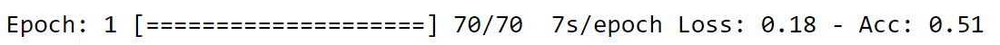
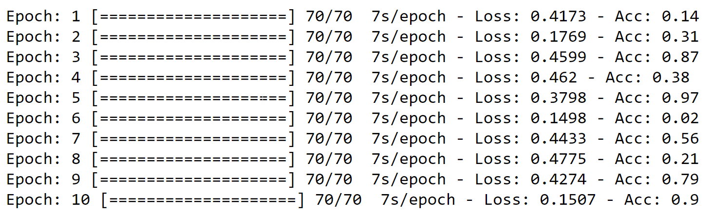

# Progress Bar Python - for Jupyter Notebook [](https://github.com/tarunk04/progress-bar-python/blob/master/LICENSE)

Simple and easy to use progress bar to monitor the progress in required task. Only supported Jupyter Notebook. No specific package requirement, can run on any Python 3 environment.

# Medium Post (Tutorial)

Find the complete guide how to use this library step by step. Read medium post [here](https://medium.com/analytics-vidhya/progress-bar-python-for-jupyter-notebook-f68224955810).

# Installation 

* Clone this repository:  

  ``` console
  git clone https://github.com/tarunk04/progress-bar-python.git
  ```

  or click `Download ZIP` in right panel of repository and extract it.

* Copy `progress.py`  into your working directory.

* Read to go.

**Note: I will soon release python package for this repository.**

# Documentation 

* Import

  ``` Python
  from progress import Progress as P
  ```

* Create instance with a bar and maximum value 70

  ```python
  p = P(70,mode = 'bar') 
  ```

* Create elements for progress bar to match example progress bar. 

  

  ```python
  # defining progress bar elements
  epoch = P.Elememt("Epoch",0)
  progress_time = P.ProgressTime(postfix="/epoch")
  batch = P.Elememt("Batch",0,display_name='hide',max_value = 70, value_display_mode = 1)
  loss = P.Elememt("Loss",0)
  acc = P.Elememt("Acc",0)
  
  # progress bar [====>    ]
  bar = P.Bar()
  ```

  Syntax for P.Element, P.Bar, and P.ProgressTime objects:

  ```python
  # Element
  P.Element(name,initial_value,max_value = None,display_name="normal",value_display_mode=0,separator=":")
  """
  Element Examples:
  "Epochs: 1"
  "Epochs: 1/10"
  "1 Epochs"
  
  Parameters:
  name: name for displaying in progress for the element
  initial_value: initial value for the element
  max_value: maximum value that element can take. Note only required in display_mode =1.
  display_name: value can take form ["normal","reverse","hide"]. In "reverse" mode name will displayed after value. 
                "hide" will hide the name from progress
  value_display_mode: [0,1].default 0. Format "Epoch: 1". For 1 format "Epoch 1/10".
  separator: default ":". can be changed according to preference
  """
  # Bar
  P.Bar(max_value=None,bar_len=20, bar_marker="=", bar_pointer=">")
  """
  Element Examples:
  [======>     ]
  [------->          ]
  
  Parameters:
  max_value: not required. it will be autometically taken from Progress object.
  bar_len: lenght for the bar. [==========>    ]. default 20.
  bar_marker: default "=" can be changed according to preference.
  bar_marker: default ">" can be changed according to preference.
  """
  # ProgressTime
  P.ProgressTime(postfix="")
  """
  Element Examples:
  "100ms"
  "112s/epochs"
  
  Parameters:
  postfix: string after time
  """
  ```

* Format/ combine all element. **Note: You can create elements in any order but while combining order matters.**

  ```python
  # Formating progress bar 
  p = p(epoch)(bar)(batch)(progress_time)("- ")(loss)("- ")(acc)
  
  """
  * Any number of elements can be added. Use Bar and ProgressTime only once otherwise it 
    may cause unexpected issues.
  * To just add text anywhere in between simply add 
    p(elemt1)(bar)("Sample Text")(elemt2)....("Some More Text")...(elemtN)  
  """
  ```

  you can see the final format of progress bar using `p.get_format()`:
  

* Finally lets see how to update the progress bar:

  ```python
  p.initialize() # initializing progress bar 
  for e in range(10):
      for i in range(70):
          """
          Other code block
          
          
          ----------------
          """
          # updating progress bar elements. Values each elements can be updated by just passing the 
          # new values like below
          loss(random.randint(1000,5000)/10000) # passing dummy number
          acc(random.randint(1,100)/100) # passing dummy number
          batch(i+1)
          epoch(e+1) 
          
          # rendering progress bar 
          p.update(step = 1)
          
          # Sleep. Not required in actual usage of progress bar.
          time.sleep(0.1)
      # setting new line for next epoch. Otherwise the new epoch progress will overwrite the old one.
      p.set_cursor_position()
  ```

  

* Done 😎. Enjoy ✨.

 # Author
 Tarun Kumar

**Author's Note**

The author is not responsible for any misuse the program. Any contribution or suggestions are most welcome. Read the LICENSE carefully.
 # License
 The MIT License, see the included, see the [License](https://github.com/tarunk04/progress-bar-python/blob/master/LICENSE) file.
